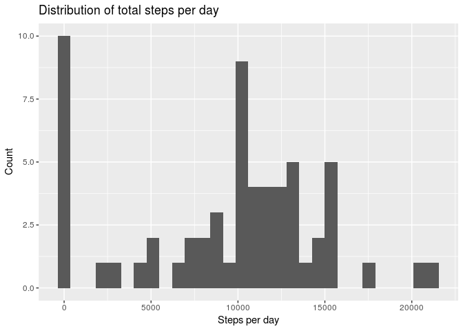
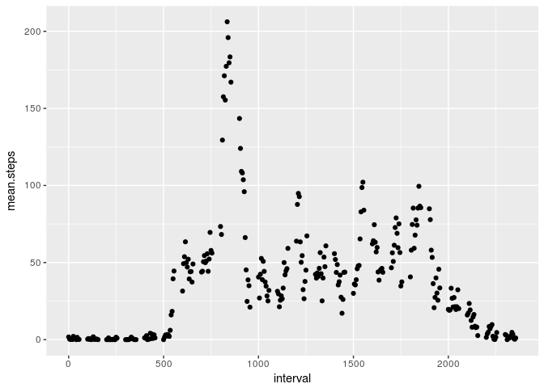
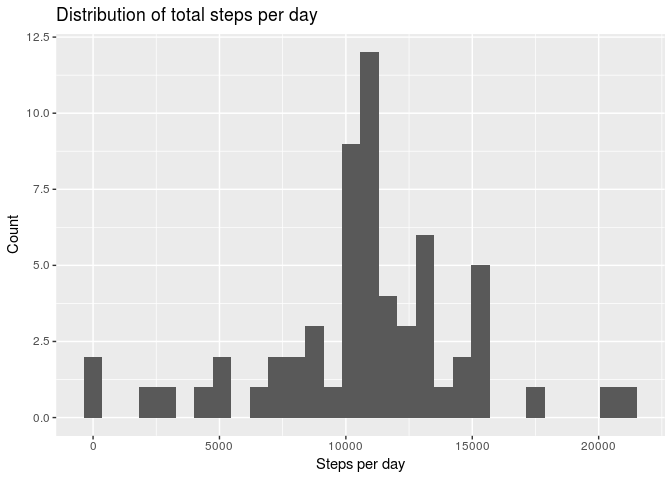
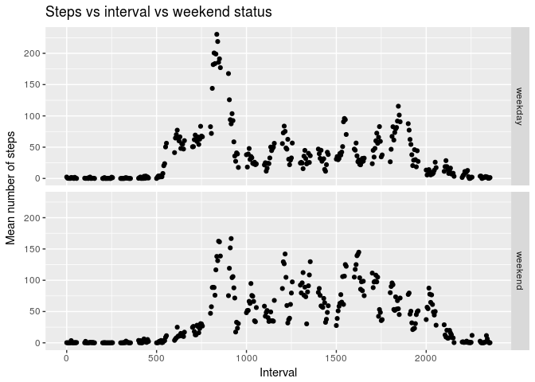

## Loading and preprocessing the data

```r
library(lubridate)
library(dplyr)
library(stringr)
library(tidyr)
library(ggplot2)

if (!file.exists("data")) {
  dir.create("data")
}
unzip("activity.zip", exdir="data")

# Read it in and convert dates
activity <- read.csv("data/activity.csv")
activity$date <- ymd(activity$date)
```


```r
head(activity)
```

```
##   steps       date interval
## 1    NA 2012-10-01        0
## 2    NA 2012-10-01        5
## 3    NA 2012-10-01       10
## 4    NA 2012-10-01       15
## 5    NA 2012-10-01       20
## 6    NA 2012-10-01       25
```

```r
head(na.omit(activity), n=30)
```

```
##     steps       date interval
## 289     0 2012-10-02        0
## 290     0 2012-10-02        5
## 291     0 2012-10-02       10
## 292     0 2012-10-02       15
## 293     0 2012-10-02       20
## 294     0 2012-10-02       25
## 295     0 2012-10-02       30
## 296     0 2012-10-02       35
## 297     0 2012-10-02       40
## 298     0 2012-10-02       45
## 299     0 2012-10-02       50
## 300     0 2012-10-02       55
## 301     0 2012-10-02      100
## 302     0 2012-10-02      105
## 303     0 2012-10-02      110
## 304     0 2012-10-02      115
## 305     0 2012-10-02      120
## 306     0 2012-10-02      125
## 307     0 2012-10-02      130
## 308     0 2012-10-02      135
## 309     0 2012-10-02      140
## 310     0 2012-10-02      145
## 311     0 2012-10-02      150
## 312     0 2012-10-02      155
## 313     0 2012-10-02      200
## 314     0 2012-10-02      205
## 315     0 2012-10-02      210
## 316     0 2012-10-02      215
## 317     0 2012-10-02      220
## 318     0 2012-10-02      225
```

## What is mean total number of steps taken per day?
1. Make a histogram of the total number of steps taken each day.

```r
activity %>% group_by(date) %>% 
  summarise(sum.steps=sum(steps, na.rm=TRUE)) -> total.steps

qplot(total.steps$sum.steps,
      xlab="Steps per day",
      ylab="Count",
      main="Distribution of total steps per day")
```

```
## `stat_bin()` using `bins = 30`. Pick better value with `binwidth`.
```

<!-- -->

From the above, it seems that we either have very inactive subjects or we might be casting a lot of days to 0.0.

2. Calculate and report the mean and median total number of steps taken per day.

```r
total.steps %>% 
  summarise(mean.steps=mean(sum.steps), median.steps=median(sum.steps)) -> summary.steps

print(summary.steps)
```

```
## # A tibble: 1 x 2
##   mean.steps median.steps
##        <dbl>        <int>
## 1      9354.        10395
```

## What is the average daily activity pattern?

1. Make a time series plot (i.e. `type="1"`) of the 5-minute interval (x-axis) and the average number of steps taken, averaged across all days (y-axis).


```r
activity %>% 
  group_by(interval) %>%
  summarise(mean.steps=mean(steps, na.rm=TRUE)) ->
  daily.activity

qplot(data=daily.activity,
      x=interval,
      y=mean.steps)
```

<!-- -->

Note that we have gaps between bundles of intervals. This is because the interval names are really 5-minute representations of time, and they jump from `x055` to `x100`. 


2. Which 5-minute interval, on average across all the days in the dataset, contains the maximum number of steps?


```r
daily.activity[which.max(daily.activity$mean.steps), "interval"]
```

```
## # A tibble: 1 x 1
##   interval
##      <int>
## 1      835
```

## Imputing missing values

1. Calculate and report the total number of missing values in the dataset.

The following code, adapted from [Sebastian Sauer's blog](https://sebastiansauer.github.io/NAs-with-dplyr/), uses `dplyr` to extract the NA count. This is a fairly general function that can scale across any number of columns. This violates YAGNI, admittedly, but it's a good learning.


```r
activity %>%
  select_if(function(x) any(is.na(x))) %>%  # Grab any column with NAs
  summarise_all(funs(sum(is.na(.)))) -> count.NA  # Count the total num. of NAs

print(count.NA$steps)
```

```
## [1] 2304
```

2. Devise a strategy for filling in all of the missing values in the dataset.

The strategy that is to be used is to simply fill in missing values with the mean for that interval, taken from previous calculations.


```r
rownames(daily.activity) <- daily.activity$interval
```

```
## Warning: Setting row names on a tibble is deprecated.
```

```r
apply(activity, 1, 
      function(x) {
        ifelse(
          is.na(x[[1]]),
          daily.activity[trimws(as.character(x[[3]])),]$mean.steps, 
          x[[1]]
        ) 
  }) -> imputed_steps
```

3. Create a new dataset that is equal to the original datset, but with the missing data filled in.


```r
activity.imputed <- activity
activity.imputed$steps <- as.numeric(imputed_steps)
```

4. Make a histogram of the total number of steps taken each day and calculate and report the **mean** and **median** total number of steps taken per day. 

Do these values differ from the estimates from the first part of the assignment? 

What is the impact of imputing missing data on the estimates of the total daily number of steps?


```r
activity.imputed %>% group_by(date) %>% 
  summarise(sum.steps=sum(steps, na.rm=TRUE)) -> total.steps

qplot(total.steps$sum.steps,
      xlab="Steps per day",
      ylab="Count",
      main="Distribution of total steps per day")
```

```
## `stat_bin()` using `bins = 30`. Pick better value with `binwidth`.
```

<!-- -->

```r
total.steps %>% 
  summarise(mean.steps=mean(sum.steps), median.steps=median(sum.steps)) -> summary.steps

print(summary.steps)
```

```
## # A tibble: 1 x 2
##   mean.steps median.steps
##        <dbl>        <dbl>
## 1     10766.       10766.
```

Interestingly, the mean and the median are now the same. From the 61 days analysed, there are a number of values (days) in the centre of the distribution that have been reformed entirely from the imputed values. 

The distribution is far more symmetric than it was, evidenced by the fact that the median and mean are equal.

## Are there differences in activity patterns between weekdays and weekends?

1. Create a new factor variable in the dataset with two levels "weekday" and "weekend" indicating whether a given date is a weekday or weekend day.


```r
activity.imputed$day <- weekdays(activity.imputed$date)
activity.imputed %>%
  mutate(weekend=ifelse(day %in% c("Saturday", "Sunday"), "weekend", "weekday")) %>%
  mutate(weekend=as.factor(weekend)) ->
  activity.imputed
```

2. Make a panel plot containing a time series plot of the 5-minute interval (x-axis) and the average number of steps taken, averaged across all weekend days or weekend days (y-axis).


```r
activity.imputed %>%
  group_by(weekend, interval) %>%
  summarise(mean.steps=mean(steps)) ->
  weekend.activity

qplot(data=weekend.activity,
      x=interval,
      y=mean.steps,
      facets=weekend ~. ,
      xlab="Interval",
      ylab="Mean number of steps",
      main="Steps vs interval vs weekend status")
```

<!-- -->
}
